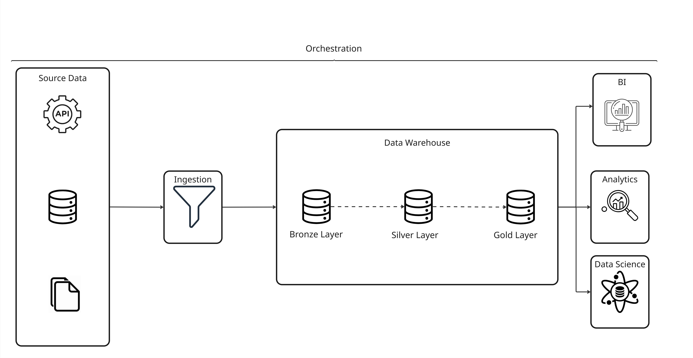
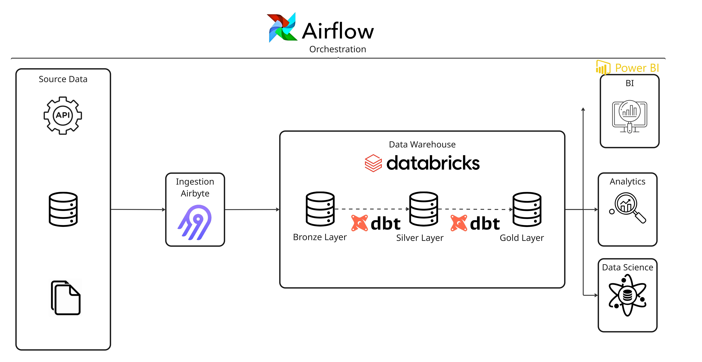

# Kieran Henderson <> Assured
## Technical Team Lead Assessment 


### Scenario 1. End-to-End Architecture Design

**Brief:**

You're tasked with building a modern, scalable data platform that ingests data from multiple systems (APIs, databases, flat files) into a central data warehouse. The platform must support:
-	Daily reporting via BI tools
-	Ad hoc analytics
-	A team of data scientists needing curated, production-grade datasets

**Task:**

- Design the architecture 
- Outline how you’d ensure scalability, data quality, and low maintenance
- Describe potential trade-offs 
- Include a diagram 


---

### Architecture Design
The chosen architecture uses a cloud native approach implementing a Medallion approach within the Data Warehouse to ensure flexibility, scalability and reliability.

Vendor agnostic:



Example of vendors:



**Source Data**

External Data sources come in many different forms (csv, xlsx, json, xml) and from disparate places (SQL, Rest, GraphQL, Sharepoint). 


**Ingestion Layer**

The ingestion layer is designed to extract data from the source systems and sink the into the bronze/raw layer of the Data Warehouse.

Depending upon the business requirements, the ingestion layer could suppose batch and/or streaming data. Batch processing would be a scheduled extract for example daily with an overnight pipeline. Streaming would be close to real-time data constantly streaming through the platform ready for real time analysis/insights.    

*Examples of Tools* 

Fivetran, Airbyte, custom Python/Spark jobs, Kafka

Airbyte has been chosen within the example provided above as it is an open source reliable system which has connectors to most data sources such as SQL, Mongo, Google Analytics.

**Data Warehouse**

```
Bronze/Raw Layer: Stores raw data in it's original form without any mondifications or transformations. 

Silver/Transform Layer: Data that has been cleansed, and transformed into normalised models

Gold/Marts/Present Layer: Analytics ready data models broken down into logical domains
```
*Examples of tools*
- Warehouse: Databricks, Snowflake, Azure Data Lake Storage
- Modelling: dbt, Spark

Databricks and DBT have been chosen within the vendor specific design above. 
DBT is an open source tool allowing Data Engineers to model data using a common language of SQL whilst allowing for customisation through Jinja templating which can help with code optimisation.

Databricks has been selected as the Data Lakehouse due to it being a well rounded and unified analytics platform. Databricks supports DBT models for processing and transforming data through the various layers (Bronze through Gold) whilst also allowing both ad hoc and data science analytics through the use of bespoke Python Notebooks all integrated within a source controlled environment. 


**Consumption Layer**

BI tools such as Looker, PowerBI or Tableau can utilize the Gold layer within the Data Lakehouse to present reporting capabilities to consumers. 

Notebooks either in Databricks or Jupyter can be used for Ad Hoc analytics as well as Data Scientists.
The data can also be exposed via API (Rest or GraphQL) for Data Scientists to consume as a part of their workflows.

Within the vendor specific diagram above, PowerBI has been selected as the BI tool to be implemented for its ease of use and price point. As the business requirements become more complex, this may necessitate a migration to a more comprehensive tool which will use the same data layer within Databricks, allowing for a smoother transition.

**Orchestration**

All of these processes and pipelines will require orchestration to ensure that data is provided in a timely manner and each of the pipelines are executed in the correct order.
Tools such as Apache Airflow or Dagster can be used for this.

The chosen platform for this is Apache Airflow. Airflow allows for the creation of DAGs to orchestrate pipelines to run in a particular sequence with some executing in parallel. Airflow can be extendd through custom Python code to allow for messages to be sent to MS Teams or Slack for monitoring purposes. 

---

### Scalability, Data Quality & Maintenance

**Scalability**

- Utilising auto-scaling or serverless compute within the cloud data warehouse. In the scenario where a business requires a scheduled data refresh, the clusters need only to be span up during operational hours. Once the pipelines have been completed, these clusters can be span back down. This prevents unnecessary resources being used and reduces cost of the compute layer. 

- Configuring the orchestration tool to run processes in parallel providing the configured compute allows. Some small independant parts of the pipelines may be able to run in parallel without the need for an increase to the cluster size, this will speed up the time execution time of the main pipeline and therefore reduce compute cost through spinning clusters down sooner. 

- Configuring the modelling tool (dbt) to use incremental models. Using incremental models means that each time the pipeline executes, it only needs to process new or changed records - there is no need to re-process data that has not changed. Similar to above, this will reduce the total execution time, ensures the pipeline is as efficient as possible and keeps the computational burden to a minimum.

Utilizing cloud data warehouses that separate compute and storage ensures cost-effective scaling

**Data Quality**

Implement Data Quality checks (dbt tests) throughout the models to ensure data quality throughout the models. This automates a lot of the operational tasks that would need to be carried out on the data to ensure data is kept to a good standard before being able to proceed to the next data layer. 

Alerts for data quality threshold breaches and orchestration failures (through Slack or MS Teams channels). Data that has breached the threshold can be moved to a quarantine area within the Data Lakehouse for analysis. 

**Low Maintenance**

Managed/Cloud services such as Databricks, Airbyte, Fivetran can be used to reduce the infrastructure maintenance. 

Keeping the data models small and domain specific will ensure easier code maintenance and reusability.

Implementing Airflow/Dagster with automated retries and notifications of succes/error 

---

### Trade-Offs

Using managed/cloud tools (e.g. Fivetran or Databricks) whilst simplifying their respective areas within the architecture, may limit the ability to create custom logic/transformations when compared to custom ELT processes. Utilising these vendors may also have limitations around licensing, especially when considering the consumption and visualization layer. As the number of users and complexity of models increases, so does the cost. 

To combat some of the trade-offs for vendor lock in, it is possible to self-host & manage some of these tools. Airbyte for example is an open source tool that can be self hosted and provides similar functionality to Fivetran, but would lack the dedicated support that a managed service would offer. Many open source vendors support containerisation through Docker & infrastructure as code through Kubernetes which provinding the business has the skillset could make self-hosting open source tools relatively straight forward. 

Using cloud data lakehouses also allows for the separation of compute and storage. Yhis helps to reduce cost through decoupling and allowing for compute to spin down when not in use. Whilst this is possible in a self-managed infrastructure, it would require a lot of work to setup and maintain. 

Consideration will also need to be given to whether the business requires real-time analystics. If so, the architecture would need to be designed to support streaming. If real-time analytics, then services such as Apache Kafka can be implemented within the architecture to act as a pub-sub method. Upstream services can publish messages to Kafka topics as and when required, from here software such as Apache Airbyte cna be used to subscribe to the Kafka topic in order to consume the data in near real time. This would have an impact to the complexity of the architeture and possibly the cost in terms of compute as data will need to be in transit through the Lakehouse layers constantly meaning there may need to be compute being used constantly. 
If batch analytics suffice, then a simple scheduled process would work well. This would reduce the complexity and cost of the infrastructure. 


--- 

### Scenario 2. Data Pipeline Debugging

#### Brief
A daily pipeline that ingests reservations and folios is failing inconsistently. Logs show variable record counts and schema mismatch errors. Business relies on this for 6am reports.

#### Task
- Outline your approach to identify and resolve the issue
- Propose changes to improve resilience and observability
- Suggest monitoring or alerting tools you’d use

---

### Identification & Resolution

**Analyse the pipeline**

The first steo would be to analyse the pipeline DAG to understand the following:

- Source system
- Ingestion method (batch or streaming)
- Destination for the data
- Transformation (e.g. DBT models being executed)
- Where in the pipeline schema enforcement could be in place

**Isolate the failing runs**

Collect a series of logs from both successful and failed runs for analysis. 
Identify if there are any patterns or anomolies within timestamps, latency or source data set.

**Confirm upstream behaviours**

As the logs show variable record counts and schema missmatches, the upstream proceeses should be checked to determine if they have a dynamic schema whereby columns are dropped or if their processes complete at inconsistent times causing the source dataset to be incomplete by the time the daily pipeline starts execution.

**Reproduce the failure locally**

Re-run the ingestion pipeline for a date which is known to have failed in a development environment. From the debugging logs, identify if there are any schema differences and check that the expected row count matches the value provided by the executed pipeline. 

**Examine transformation logic**

If there are joins between Folios and Reservations within the transformation models, then there may be issues with either of the source datasets such as null keys or perhaps some rows are being filtered out due to NULL or misaligned records. 

**Root cause identification**

After this analysis, there should be enough information to identify the root cause, which is likely to be a dynamic schema being provided from the source system which is not being handled within the daily pipeline. This will identify the fix that will need to be put in place to prevent further failures. 


### Resilience & obervability improvements

**Schema drift**

If using a custom ingestion process, ensure that schema drift is supported or that if a schema difference is identified to handle this within the code in order to eliminate schema changes as causing failing pipelines.  

If using an ingestion tool such as Airbte, ingest the raw data as-is into the Bronze/Raw layer which can then be normalized into the Silver layer

**Incremental & Retries**

Implement incremental pipelines, so that any late arriving data can be backfilled without the need for full refreshes.

Implement a retry policy throughout the orchestration process to alleviate transient issues that would not require human intervention to resolve. 

**Observability**

Through the use of tools such as dbt tests, Airflow, Datadog or Grafana metrics such as pipeline durations, record counts and potential stack traces can be captured and reported on in a visual manner allowing for monitoring of the platform. 

In addition to reporting on metrics and logs, pipelines can be monitored through frequently used communication systems such as MS Teams or Slack whereby a dedicated channel can be set up for pipelines to send messages on pipeline start, error and completion. This gives a real time way for Engineers or Ops to identify a failed pipeline. 

---


### Scenario 3. Data Quality & Governance

### Brief
You’ve inherited a warehouse where customer data is duplicated and has inconsistent field formats across sources.

### Task
- Outline your strategy to improve data quality long term
- Specify tools or frameworks you'd implement
- Share how you'd enforce consistency in future pipelines

---

### Long term data quality improvements

**Immediate term**

- *Data profiling:* understand where data is stored, in what form and if there are inconsistencies within the data.

- *Source system analysis:* determine what systems contain customer data (CRM, transactional database).

- *Stakeholder communication:* establish a glossary of terms so there is a single definition of a unique customer.

**Short term**

- *Customer model:* from the raw ingested data, stage the customer data from the various sources including cleansing, deduplicating and merging fresh updates and create a single customer model to be used as the single source of truth of customer records. 

**Medium - Long term**

- *Validation:* Schedule and implement tests (dbt) to test for uniqueness, completeness and conformance

- *Governance:* Create a Data Dictionary/Catalog to document field and domain definitions as well as their owners. 

- *Data owners:* Assign data stewards responsible for the customer data domain. Issues pertaining to customer data should be raised to the data steward.

- *Education:* Run regular reviews of definitions and practices implemented in the customer data domain with data producers & consumers.


### Tools / frameworks to be implemented

**Modelling**

For modelling the customer data model, DBT can be used as a means to stage the data from the raw inputs through the to the gold standard cleansed and transformed customer model stored within Databricks. 

**Validation**

DBT tests can be used within the pipeline to test the data quality. Any records that fail the quality checks can be quarantined and therefore prevented from passing through to the final customer data model. 

**Governance**

Microsoft Purview is a very comprehensive data governance tool which offer data dictionary and catalog functions along with integration for data lineage and access controls. However, this can prove to be very costly. An open source alternative to the data catalog requirements is DataHub. Implementing a data catalog allows for data points to be easily discoverable along with comments and tags (which can be used to tag if a particular data point is sensitive i.e. PII)


### Future pipeline consistency


---

### Scenario 4. Onboarding & growing the team

### Brief
Describe your strategy for nurturing junior data engineers into well-rounded, autonomous contributors.

### Include
- Onboarding process
- Tools, techniques for skill development
- Metrics of success

#### Answer


---